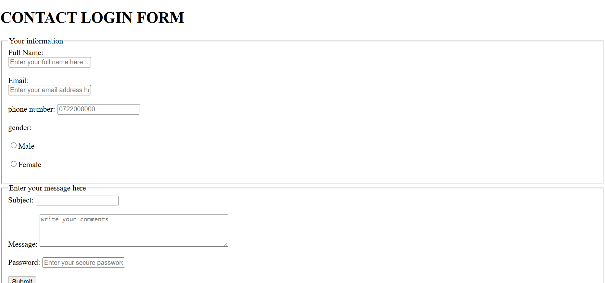

Here's a complete and detailed `README.md` file tailored specifically for this HTML **Contact Login Form**. It explains the structure, purpose, accessibility features, and validations:

---

````markdown
# Contact Login Form

This project is a responsive and accessible **Contact Login Form** built using pure HTML. The form collects essential user details like full name, email, phone number, gender, subject, message, and password. It includes modern features like validation attributes and ARIA labels for improved accessibility and user experience.

## 🚀 Features

- **Form Structure:**
  - Organized using `<fieldset>` and `<legend>` for clarity.
  - Includes sections for personal info, gender, subject, message, and password.

- **Accessibility Improvements:**
  - Uses `aria-label` for assistive technology (e.g., screen readers).
  - Each `<input>` is properly paired with a `<label>` for better usability.

- **HTML5 Validation:**
  - `required` attributes ensure mandatory fields are filled.
  - `type="email"` validates email format.
  - `type="tel"` uses a basic pattern for phone numbers.
  - `minlength` and `maxlength` on passwords enforce strong credentials.
  - `placeholder` values guide the user on expected input.

## 📄 Form Fields

| Field         | Type       | Validation                   | Description                               |
|---------------|------------|------------------------------|-------------------------------------------|
| Full Name     | Text       | Required                     | User's full name                          |
| Email         | Email      | Required, Valid email format | User's email address                      |
| Phone Number  | Tel        | Pattern: `[0-9][10]`         | Kenyan-style phone (placeholder shown)    |
| Gender        | Radio      | Required                     | Gender selection (male/female)            |
| Subject       | Text       | Optional                     | Subject of the message                    |
| Message       | Textarea   | Optional                     | User comments or inquiries                |
| Password      | Password   | Required, 5–30 chars         | For authentication or secure input       |

## ✅ Accessibility

- Uses `aria-label="CONTACT FORM"` to help screen readers understand the form purpose.
- Every input field is connected with a `<label>` using the `for` and `id` attributes.
- Uses semantic HTML elements (`<fieldset>`, `<legend>`) to group related fields.

## 💡 Improvements to be made in future with future practice 

- Add JavaScript for enhanced interactivity or dynamic error handling.
- Include tooltips or inline validation messages.
- Use regex patterns to refine phone number validation:
  ```html
  pattern="^07\d{8}$"  <!-- For Kenyan phone numbers -->
````

* Style the form with CSS to enhance visual aesthetics and responsiveness.

## 🛠️ How to Use

1. Save the HTML content in a file named `contact-form.html`.
2. Open the file in any modern web browser.
3. Fill in the form fields and click **Submit**.
4. The form action is currently set to `/submit`. You’ll need a backend to handle POST requests.

## 🔐 Security Tips

If you use this form in a real application:

* Always sanitize user inputs on the server side.
* Use HTTPS to encrypt form data during transmission.
* Never store plain-text passwords.

## 📸 Screenshot Preview

## 📸 Screenshot

This is how the form looks in the browser:




---

Built with ❤️ using HTML5

```


